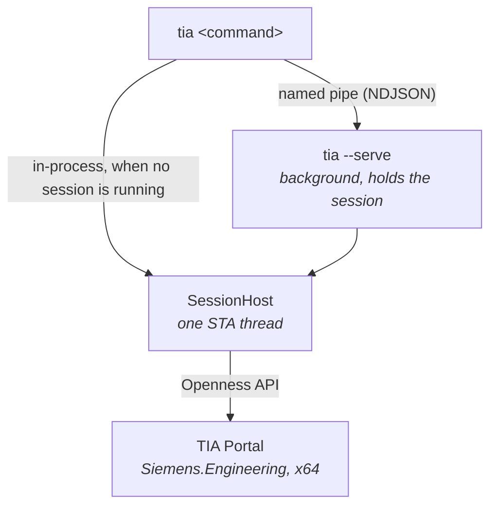

# tia-cli

A command-line tool that drives **Siemens TIA Portal** through the Openness API — list devices,
read and export program blocks, create tags, import SCL, compile — from a terminal or a script.

The point of it is the session handling. A CLI process lives for a second; an Openness connection
does not survive it, and opening a project takes minutes. So `tia` works two ways at once:

- **It joins the TIA Portal you already have open.** No setup, no flags — `tia devices` attaches to
  the running instance, answers, and detaches.
- **It can start and keep one of its own.** `tia session start` launches a portal and holds it in a
  background process, so the next fifty commands reuse it — and reuse the project you opened.

```bash
tia devices                                   # uses the portal already on your screen
tia session start --project C:\p\Line.ap20    # or start one and keep it warm
tia blocks PLC_1 --filter Motor
tia compile PLC_1 && tia project save
```

## How it is put together



One executable plays both parts. `tia <command>` checks for a running session first and, finding
one, becomes a pipe client that never loads Openness at all; finding none, it does the work itself.
Commands are written against an `IExecutor` and cannot tell the difference.

| Piece | Job |
| ----- | --- |
| `Cli/` | Parsing, verbs, table and `--json` rendering, the interactive shell |
| `Daemon/` | Named-pipe server and client, state file, log |
| `Openness/` | Assembly resolution, the STA thread, session acquisition, all Openness calls |
| `Protocol/` | Request/response shapes, DTOs, error codes, exit-code mapping |

### How a command finds TIA Portal

In order:

1. the session started by `tia session start`, if one is running;
2. the single TIA Portal already running on this machine;
3. nothing — the command stops and says so, unless `--start` was given.

Two portals running and no session is the one ambiguous case; `tia` refuses to guess and asks for
`--attach <pid>`. `tia portals` lists what is there.

Whether a portal closes when you are done follows from who started it. One that `tia` started is
owned by `tia` and closes with the session; one that was already running is left alone. `tia session
status` says which it is holding, in those words, before you stop it.

## Requirements

- Windows x64, TIA Portal installed **with the Openness option**.
- Your Windows account in the local **Siemens TIA Openness** group. Add it, then sign out and back
  in — membership is read at logon. Without it every call fails with `access_denied`.
- .NET 8 SDK to build. .NET Framework 4.8, which the tool targets, is part of Windows.
- A licensed TIA Portal product — normally **STEP 7 Professional** — for anything that *changes*
  hardware. Openness itself needs no licence, so connecting, opening projects, listing devices,
  blocks and tags all work without one; `device add`, `device ip` and the rest of the hardware
  surface fail with `licence_missing` (exit 8). The licence is checked when the call runs, not when
  you connect, so a machine can look entirely healthy until the first write.

`Siemens.Engineering.dll` references `System.Runtime.Remoting`, which exists only in .NET Framework —
so the tool targets net48 even though it is built with the .NET 8 SDK.

## Install

Unpack `tia-cli-<version>-win-x64.zip` and run, from the folder it made:

```bash
powershell -ExecutionPolicy Bypass -File install.ps1
```

It checks the machine over first — .NET Framework 4.8, an Openness installation, your membership of
the **Siemens TIA Openness** group — and says which of them is missing rather than leaving you to
find out one failed command at a time. Then it copies the tool to `%LOCALAPPDATA%\Programs\tia-cli`
and puts that on your user PATH. Nothing needs administrator rights and nothing outside your profile
is written. Open a new terminal afterwards, since the one you ran it from still has the old PATH.

`-InstallDir <path>` puts it somewhere else, `-NoPath` leaves your PATH alone. Installing over an
existing copy stops its session first — a background session owns a TIA Portal, and replacing the
exe underneath it would strand that portal with nothing left to close it.

To remove it:

```bash
powershell -ExecutionPolicy Bypass -File "%LOCALAPPDATA%\Programs\tia-cli\uninstall.ps1"
```

Which stops the session, takes the folder off your PATH, and deletes both the tool and its state
file and log. `-KeepData` keeps the latter two. The Openness whitelist entry under HKLM is left
alone, being harmless once the exe it names is gone; an elevated `-RemoveWhitelist` run clears it.

## Build

```bash
powershell -File tools/build.ps1
```

That publishes `dist\tia.exe` to run in place while you are changing it — the inner loop, not a way
to install. It leaves PATH alone; `install.ps1` owns that, and two scripts adding two different
folders is how you end up with a `tia` answering from somewhere unexpected that outlives an
uninstall. Pass `-OpennessAssemblyPath <path>` if TIA Portal is not at the default location — only
the compile-time reference is affected, since at runtime the assembly is found through the registry
and one build drives whichever version is installed.

Unit tests cover the parts that run without Openness — argument parsing, the wire protocol, error
translation and exit codes, the daemon state file:

```bash
dotnet test src/Tia.Cli.Tests/Tia.Cli.Tests.csproj
```

To build the release zip — tests, a fresh publish, the install scripts and a `.sha256`, into
`dist\`:

```bash
powershell -File tools/package.ps1
```

It always publishes fresh rather than packaging whatever is sitting in `dist\`, and refuses to
package at all if the tests fail. The version comes from `Version` in `Directory.Build.props`, which
is the one place it is written; `tia --version` reads it back off the assembly.

## The first run pauses for a dialog

The first time a given `tia.exe` talks to Openness, **TIA Portal puts an "Openness access" window on
screen and blocks until you answer it**. Approve it once and the approval is recorded under
`HKLM\SOFTWARE\Siemens\Automation\Openness\<version>\Whitelist`.

The record holds the exe's path *and* a hash of its bytes, so **rebuilding or moving `tia.exe` asks
again**. That is why a command can appear to hang with nothing on the terminal: the window belongs to
TIA Portal, and a daemon started in the background gives you no hint that it is waiting for one.
`tia` checks the whitelist before it connects and warns you when this run is going to need it.

Two details worth knowing, both learned the hard way:

- **While that window is unanswered, the portal answers nothing** — not even a call from an unrelated
  program. So a command that needs no approval of its own (`tia portals` only enumerates processes)
  can still hang behind somebody else's pending dialog. If a command stalls, look for the window
  before assuming the tool is stuck.
- **Approval follows the bytes, not the name.** Killing a client does not withdraw its pending
  request, and answering it later records approval for *that* build — which tells you nothing about
  the one you are running now.

## Commands

Run `tia help` for the full text.

| | |
| --- | --- |
| `tia portals` | TIA Portal instances running on this machine |
| `tia session start` | Start a background session and keep it. `--new`, `--headless`, `--attach <pid>`, `--project <path>`, `--idle <minutes>` |
| `tia session status` | What is running, what it is attached to, what is open |
| `tia session stop` | End the session |
| `tia shell` | Interactive prompt holding one session open |
| `tia project open <path>` | Open a project (`--upgrade`) |
| `tia project new <dir> <name>` | Create one |
| `tia project info` / `save` / `close` | `close --save` to save on the way out |
| `tia devices` | Stations, their CPUs and addresses |
| `tia catalog <filter>` | Search the hardware catalog for order numbers |
| `tia device add <type> <name>` | Add a station from a type identifier |
| `tia device ip <device>` | `--address <ip> --mask <netmask>`, `--subnet <name>` for the TIA subnet, gateway with `--router <ip>` / `--no-router` |
| `tia blocks <device>` | List blocks (`--filter`, `--system`) |
| `tia block export <device> <block>` | Openness XML (`--out <path>`, `--print`) |
| `tia scl import <device> <name>` | From `--file`, `--code`, or stdin (`--no-generate`) |
| `tia tables <device>` / `tia tags <device>` | Tag tables and tags (`--table`) |
| `tia table add` / `tia tag add` | Create them (`--type`, `--address`) |
| `tia compile <device>` | Compile. Exits non-zero when it reports errors. |
| `tia download <device>` | Download to the PLC (`--address`, `--via`, `--interface`, `--slot`, `--hardware`, `--changes`, `--stopped`, `--force`) |
| `tia upload <ip>` | Upload the station at that address into the project as a new station |
| `tia sim start <device>` | Download to S7-PLCSIM, which starts the simulator (`--advanced` for PLCSIM Advanced) |
| `tia show hw` | Open the hardware editor (`--view device\|network\|topology`) |
| `tia show device <device>` | Open one station in it (`--view ...`) |
| `tia show block <device> <block>` | Open a block's editor |
| `tia show table <device> <table>` | Open a tag table |

Global: `--json`, `--attach <pid>`, `--start`, `--headless`, `--new`, `--no-daemon`,
`--openness-version <v>`, `--quiet`.

### Scripting

`--json` prints the raw result of any command, and exit codes are specific:

```
0 ok   1 failed   2 bad arguments   3 no session   4 no project   5 not found
6 ambiguous   7 access denied   8 licence missing   9 portal unusable
```

```bash
tia devices --json | jq -r '.[].name'
type block.scl | tia scl import PLC_1 Motor
tia compile PLC_1 || echo "compile failed"
```

## Things that are not obvious

- **Everything runs on one STA thread.** The Openness object model is not thread-safe and hands back
  objects bound to the thread that made them; calling from a pool thread produces intermittent
  `RemotingException`s rather than a clean error. One thread also serialises requests, which is right
  anyway — TIA cannot service two at once.
- **`Siemens.Engineering.dll` is a compile-time reference only.** At runtime it is located through
  `HKLM\SOFTWARE\Siemens\Automation\Openness` and handed to the CLR by an `AssemblyResolve` handler.
- **No method that touches Openness may be entered before that handler is installed.** The JIT
  resolves a method's types when the method starts, not line by line, so the executor is built
  through a deliberate two-step with a `[MethodImpl(NoInlining)]` core. `Program.cs` references
  nothing Openness-backed.
- **`TiaPortalProcess` has two lifetimes, and the GC knows about neither.** The handles
  `TiaPortal.GetProcesses()` returns are detached and must be disposed. The one
  `portal.GetCurrentProcess()` returns shares the portal's lifetime — disposing it disposes the
  connection. Not disposing it is not enough: the type has a finaliser, so a handle left to become
  garbage kills the portal at the next collection, seconds later and nowhere near the code that
  fetched it. When the portal is one this tool started, that closes the process outright — the
  symptom is a session that works, then reports "no longer running" about a portal that really has
  gone. The handle is fetched once and held in a field for the life of the session.
- **The daemon answers `ping`, `status` and `stop` on the connection thread**, not through the
  Openness queue. So `tia session status` still replies while a project is opening, which is exactly
  when you want to ask.
- **A project opened in the UI after `tia` attached is picked up anyway.** Rather than fail with "no
  project open", the session re-probes the portal's project list first — attaching to someone's live
  portal is the main use case, and their project appearing mid-session is normal.
- **`tia project new` writes nothing to disk until `tia project save`**, and blocks made by
  `scl import` are not checked until `tia compile`.
- **A download is a dialog, even without a screen.** Openness turns TIA's download dialog into a
  series of callbacks, and an unanswered one aborts the transfer. `tia download` answers the routine
  prompts the way the dialog's defaults would and records each answer in its output; the destructive
  ones — reset module, reinitialize data blocks, firmware up/downgrade, protection-level changes —
  abort with the prompt's name unless `--force` was given. Password prompts are always refused: a
  CLI has no business holding PLC passwords. An unrecognised prompt aborts by name so it can be
  added deliberately rather than answered by accident.
- **There is no "start simulation" call in Openness.** What exists is downloading to the `PLCSIM`
  connection mode, which boots the simulator on the way — that is what `tia sim start` does. The
  mode itself only exists when S7-PLCSIM is installed, so its absence from the mode list is both the
  detection and the error message. PLCSIM Advanced instances are a different target: same download,
  but the software-target prompt is answered with `--advanced`.
- **A running session only knows the wire methods of the binary it was started from.** After a
  rebuild that adds commands, `tia session stop` and start again — otherwise the old daemon answers
  new verbs with "Unknown method".
- **A project opened through Openness stays in the portal view until an editor is asked for.** That
  is what the `show` verbs are: `ShowHwEditor(View)` on the project, `ShowInEditor()` on a block or
  tag table — the one corner of Openness that drives the UI rather than the data. They need a portal
  started `WithUserInterface`, so a headless session refuses them with an explanation rather than an
  obscure Openness failure.
